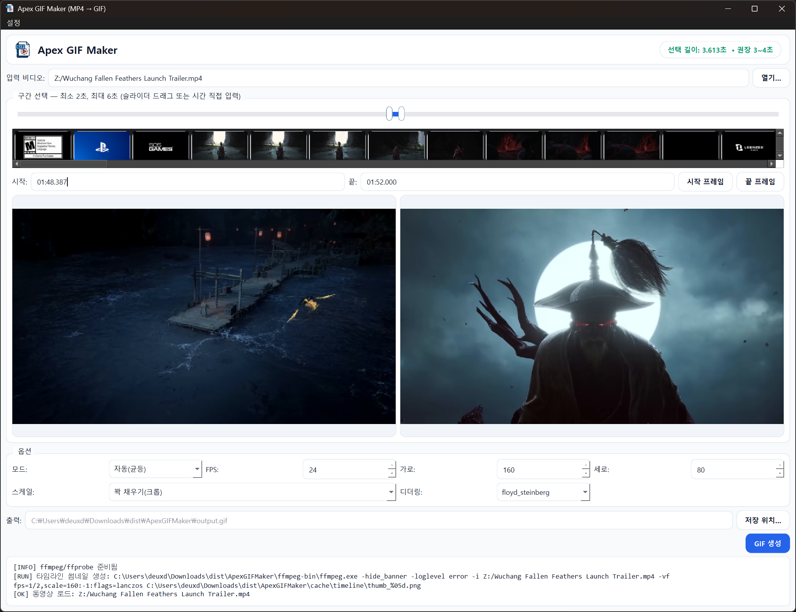

<p align="center">
  
</p>

## 🎥 데모

| [](https://youtu.be/-bZaF1CrjNI "Apex GIF Maker Demo") |
|:--:|
| *클릭하면 YouTube로 이동* |

---

<h1 align=center>
  
  Apex GIF Maker (MP4 → GIF)
</h1>

| [](https://github.com/deuxdoom/APEXGIFMAKER/releases/latest) [](https://github.com/deuxdoom/APEXGIFMAKER/releases) [](https://python.org) [](https://ffmpeg.org) [](#) [](./LICENSE) |
|:--:|

플라이디지 **APEX** 게임패드 스크린용 **MP4 → GIF 메이커**
구간을 드래그로 선택하고, 프리뷰 확인 후 한 번에 GIF를 만든다.

---

## ✨ 주요 기능
- **구간 선택(2–10초 강제)**: 슬라이더 드래그 + 시간 직접 입력(hh:mm:ss.mmm)
- **시작·끝 2분할 프리뷰**(1280×720), **2초 간격 타임라인 썸네일**
- GIF 품질 최적화: **2-pass 팔레트**, **디더링(FS/Bayer/None)**, **FPS/해상도** 조절
- 스케일 3가지: **꽉 채우기(크롭·기본)** / 레터박스(비율 유지) / 스트레치
- 자동(균등/중복제거) + **수동 프레임 선택**(체크로 골라서 합성)
- **FFmpeg 자동 준비**(Windows essentials.zip 다운로드·해제) 후 **정리(ffmpeg/ffprobe만 유지)**
- **포터블 배포**(one-folder), 콘솔창 숨김, **아이콘 내장(Base64 PNG)**

---

## ⬇️ 다운로드
- **Latest Release**: https://github.com/deuxdoom/APEXGIFMAKER/releases/latest  
  내려받은 ZIP을 풀고 `ApexGIFMaker.exe` 실행.

---

## 🚀 빠른 사용
1. `ApexGIFMaker.exe` 실행 → **입력 비디오** 선택(MP4 등)
2. 슬라이더로 구간 지정(또는 시간 직접 입력) → **시작/끝 프리뷰** 확인
3. 옵션(FPS/해상도/스케일/디더링, 자동/수동)을 필요만큼 조정
4. **GIF 생성** → 실행 폴더에 저장(기본 파일명 자동 제안)

> 캐시는 `./cache` 폴더에 저장됨(프리뷰/타임라인/스캔 이미지).

---

## 📦 릴리즈 구성
```text
ApexGIFMaker_x64/
├─ ApexGIFMaker.exe
├─ ffmpeg-bin/
│ ├─ ffmpeg.exe
│ └─ ffprobe.exe
├─ cache/ # 프리뷰/타임라인/스캔 캐시
├─ ATTRIBUTION.txt # Flaticon 아이콘 고지
└─ LICENSE # MIT
```

---

## 🧩 호환
- **Windows 10/11 x64**
- 실행에 추가 설치 불필요(FFmpeg 자동 준비)

---

## 🛠 트러블슈팅
- **아이콘/작업표시줄이 기본 아이콘으로 나옴** → 기존 “작업 표시줄 고정” 해제 후 다시 고정(캐시 갱신)
- **FFmpeg 다운로드 실패** → 네트워크 확인 후 재실행, 또는 메뉴에서 경로 수동 지정
- **출력 GIF 없음** → 로그 창 오류 확인(구간 길이 2–6초 범위 준수 필요)

---

## 📝 Attribution
- Icon: **“GIF file”** by **Freepik** on **Flaticon**  
  https://www.flaticon.com/free-icon/gif-file_3979434  
  License: Free for commercial use with attribution.  
  → 배포 ZIP에 `ATTRIBUTION.txt` 포함

## 📄 License
- MIT License — 상세 내용은 [LICENSE](./LICENSE) 참조.