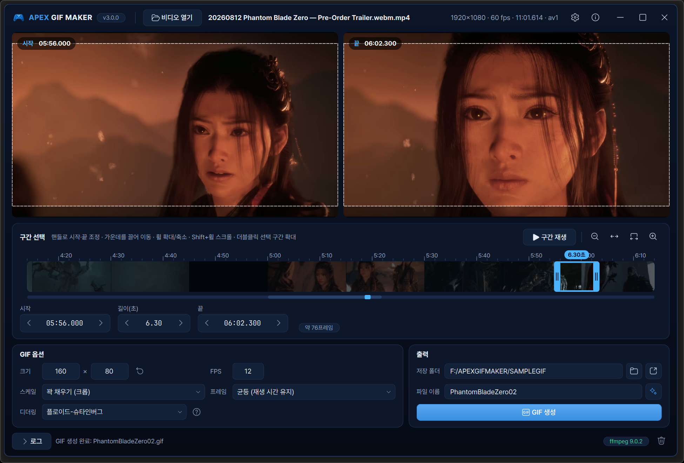

  

<h1 align="center">APEX GIF MAKER</h1>

  <b>좋아하는 영상의 한 순간을, 컨트롤러의 작은 화면으로.</b> 
  Flydigi APEX 시리즈 스크린에 넣을 GIF를 만드는 무료 Windows 프로그램입니다.

  
  
  
  
  

  

<!-- 새 버전 공개 시 다운로드 버튼, windows-download 참조 URL, 공개 버전 안내를 함께 갱신합니다. -->
<!-- <a> 안에 줄바꿈이나 공백을 넣으면 GitHub가 버튼 사이에 밑줄 친 빈칸을 그리므로, 링크는 한 줄로 붙여 씁니다. -->

  
  

  <b>다운로드 버튼을 누르면 프로그램 ZIP 파일이 바로 내려받아집니다.</b> 
  현재 공개 버전: <b>v3.0.0</b> · Windows 10/11 x64 · 무료 · 설치 없이 실행

  <a href="#빠른-시작">빠른 시작</a> &nbsp;·&nbsp;
  <a href="#주요-기능">주요 기능</a> &nbsp;·&nbsp;
  <a href="#gif-만들기">GIF 만들기</a> &nbsp;·&nbsp;
  <a href="#자주-묻는-질문">자주 묻는 질문</a> &nbsp;·&nbsp;
  <a href="CHANGELOG.md">변경 기록</a>

## 빠른 시작

| 순서 | 이렇게 하세요 |
|:--:|---|
| **1. 다운로드** | 위의 **Windows ZIP 바로 다운로드** 버튼을 누르거나 [여기를 눌러 프로그램을 받으세요][windows-download]. |
| **2. 압축 풀기** | 받은 ZIP 파일을 마우스 오른쪽 버튼으로 누르고 **모두 압축 풀기**를 선택하세요. |
| **3. 실행** | 압축을 푼 폴더를 열어 **`ApexGIFMaker.exe`를 두 번 클릭**하세요. 별도 설치나 Python 설치는 필요 없습니다. |

**압축 파일 안에서 바로 실행하지 말고, 먼저 전체 압축을 풀어 주세요.** 실행 파일 옆의 폴더도 프로그램에 필요하므로 함께 보관합니다.
영상 변환 도구인 FFmpeg는 처음 실행할 때 앱이 자동으로 받아 둡니다(3.0부터는 켤 때마다 최신 버전으로 맞춥니다). 이때는 인터넷 연결이 필요합니다.

> 이 앱은 **GIF 파일을 만드는 도구**입니다. 완성한 GIF를 컨트롤러에 넣는 작업은 **Flydigi 공간정거장(Space Station)**에서 진행합니다.

## 주요 기능

| 기능 | 할 수 있는 일 |
|---|---|
| **정밀한 구간 선택** | 시작·끝 손잡이, 타임라인 확대, 시간 직접 입력으로 필요한 장면만 고릅니다. |
| **변환 전 미리보기** | 시작과 끝 장면, 화면에 들어갈 영역을 크롭 가이드로 확인합니다. |
| **스크린에 맞춘 출력** | 기본 **160×80 · 12 FPS**에서 시작해 크기·FPS·화면 맞춤 방식을 바꿉니다. |
| **GIF 품질 조절** | 영상에 맞춘 팔레트, 디더링, 균등·중복 제거 프레임 옵션을 제공합니다. |
| **진행·결과 확인** | 변환 진행률을 보고 취소할 수 있으며, 완료된 GIF를 앱에서 바로 재생합니다. |
| **편리한 관리** | FFmpeg 자동 준비와 최신 버전 유지, 3.0부터 앱 내 업데이트, 다크·라이트·시스템 테마를 지원합니다. |
| **6개 언어** | 한국어, 영어, 스페인어, 일본어, 중국어 간체·번체를 지원합니다. |

영상은 서버로 업로드하지 않고 **내 PC에서 변환**합니다. APEX 4·5·6 등 사용자 GIF를 등록할 수 있는 APEX 시리즈를 대상으로 하며,
기본 출력 크기는 160×80입니다. 등록 가능한 파일 조건은 사용 중인 컨트롤러와 Space Station에서 확인해 주세요.

## GIF 만들기

1. **영상을 엽니다.** `비디오 열기`를 누르거나 동영상 파일을 창으로 끌어다 놓습니다.
2. **원하는 구간을 고릅니다.** 타임라인의 양쪽 손잡이를 움직여 시작과 끝을 정합니다.
3. **화면과 옵션을 확인합니다.** 처음에는 **160×80 · 12 FPS · 꽉 채우기** 기본값으로 시작하세요.
4. **저장합니다.** 저장 폴더와 파일 이름을 확인한 뒤 `GIF 생성`을 누릅니다. 완료 창에서 결과를 확인할 수 있습니다.
5. **컨트롤러에 적용합니다.** Flydigi Space Station의 스크린 설정에서 만든 GIF를 불러옵니다. 메뉴 이름은 버전에 따라 다를 수 있습니다.

**처음에는 짧은 구간으로 만들어 보세요.** 앱에서 선택할 수 있는 길이는 1~30초이며, 15초 이하를 권장합니다.
파일이 너무 크면 구간을 줄이거나 FPS를 낮추면 됩니다.

<b>타임라인 조작과 단축키 자세히 보기</b>

| 하고 싶은 일 | 방법 |
|---|---|
| 시작이나 끝만 바꾸기 | 구간 양쪽의 손잡이를 끕니다 |
| 길이는 그대로 두고 옮기기 | 구간 가운데를 끌거나, 방향키 ← →를 누릅니다 |
| 원하는 곳으로 바로 옮기기 | 막대의 빈 곳을 누릅니다 |
| 크게 늘려 보기 / 줄여 보기 | 마우스 휠을 돌리거나 `+` `-` 키를 누릅니다 |
| 전체 다시 보기 | `0` 키를 누르거나, 타임라인 오른쪽 위의 '전체 보기' 단추를 누릅니다 |
| 옆으로 옮겨 보기 | Shift 키를 누른 채 휠을 돌립니다 |
| 고른 구간에 맞춰 크게 보기 | 구간을 두 번 누릅니다 |
| 0.1초씩 정밀하게 조정 | 시간 칸의 ◀ ▶를 누릅니다 (Shift를 누르면 1초씩) |
| 시간을 직접 입력 | 시간 칸에 `01:23.500`이나 `83.5`처럼 적고 Enter를 누릅니다 |

<b>크기·FPS·화면 맞춤·디더링 옵션 알아보기</b>

| 옵션 | 설명 |
|---|---|
| 크기 | GIF의 가로×세로 크기입니다. APEX 화면에 맞는 기본값은 **160×80**이고, ↺ 단추로 되돌릴 수 있습니다. |
| FPS | 1초에 넣는 장면 수입니다. 높을수록 부드럽지만 파일이 커집니다. 기본값은 12입니다. |
| 스케일 | **꽉 채우기**: 화면을 가득 채우고 넘치는 부분을 잘라냅니다(기본). **레터박스**: 영상 전체가 보이게 줄이고 남는 곳은 검게 채웁니다. **스트레치**: 비율을 무시하고 늘립니다. |
| 디더링 | GIF는 한 장면에 256색까지만 쓸 수 있어서, 작은 점을 섞어 색의 경계를 부드럽게 보이게 합니다. 보통은 기본값(플로이드-슈타인버그)이 가장 자연스럽습니다. |
| 프레임 | **균등**: 재생 시간을 그대로 지킵니다(기본). **중복 제거**: 움직임이 없는 부분을 건너뛰어 파일이 작아지지만, 재생 시간이 짧아질 수 있습니다. |

## 실제 적용 모습

아래 이미지를 누르면 APEX 5 스크린에 GIF를 적용한 YouTube 시연 영상이 열립니다.

|  |  |
|:--:|:--:|
| 누르면 유튜브로 이동합니다 | 누르면 유튜브로 이동합니다 |

## 자주 묻는 질문

<b>다운로드했는데 실행 파일이 없어요.</b>

GitHub의 `Code → Download ZIP`이나 `Source code (zip)`은 개발용 소스 코드입니다.
위의 **Windows ZIP 바로 다운로드** 버튼으로 프로그램을 다시 받은 뒤 전체 압축을 풀어 주세요.

직접 고르려면 [전체 버전 목록](https://github.com/deuxdoom/APEXGIFMAKER/releases)의 **Assets**에서
`ApexGIFMaker_252.zip`, `ApexGIFMaker_v300.zip`처럼 **ApexGIFMaker로 시작하는 ZIP**을 찾으면 됩니다.

<b>Windows에 “PC 보호” 안내가 나와요.</b>

Windows에서 아직 신뢰 정보가 충분하지 않은 앱에 표시할 수 있는 안내입니다.
이 저장소에서 직접 받은 파일인지 확인하고, 실행하기로 결정했다면 **추가 정보 → 실행**을 선택하세요.

<b>FFmpeg를 내려받지 못했다고 나와요.</b>

인터넷 연결을 확인한 뒤 앱을 다시 실행해 보세요. 수동으로 준비하려면
[FFmpeg Windows 빌드 배포처](https://www.gyan.dev/ffmpeg/builds/)에서 `ffmpeg-release-essentials.zip`을 받고,
압축 안의 `bin` 폴더에서 **`ffmpeg.exe`와 `ffprobe.exe` 두 파일**을 꺼냅니다.

- **3.0:** `ApexGIFMaker.exe` 옆의 `bin` 폴더에 넣습니다.
- **2.x:** `ApexGIFMaker.exe` 옆의 `ffmpeg-bin` 폴더에 넣습니다.

기존 폴더를 지우거나 통째로 교체하지 말고, 두 파일만 넣어 주세요.

<b>설정은 어디에 저장되나요?</b>

프로그램 폴더의 `settings.json`에 저장됩니다. 3.0에서는 해당 폴더에 쓸 수 없다면(예: Program Files)
`%LOCALAPPDATA%\ApexGIFMaker`에 저장됩니다. 설정을 초기화하려면 앱을 종료한 뒤 이 파일을 지웁니다.

<b>업데이트는 어떻게 하나요?</b>

**3.0부터** 새 버전 안내에서 `지금 업데이트`를 누르면 앱에서 업데이트할 수 있습니다.
다운로드 파일의 SHA-256 확인값을 검사한 뒤 적용하며, 설정과 FFmpeg는 유지합니다.

**2.x에서 3.0으로 옮길 때는** 3.0.0 ZIP을 직접 받아 새 폴더에 풀어 주세요.
이전 폴더의 `settings.json`을 새 폴더로 복사하면 저장 폴더와 옵션을 이어서 사용할 수 있습니다.

**FFmpeg는 3.0부터** 앱을 켤 때 새 버전이 있는지 확인해서 자동으로 최신으로 맞춥니다.
`⚙` 설정의 `도구 업데이트 (ffmpeg)`로 바로 받을 수 있고, `도구 자동 업데이트`를 끄면 자동 확인을 멈춥니다.

<b>화면 언어나 색을 바꾸고 싶어요.</b>

3.0에서는 오른쪽 위 `⚙` 설정에서 테마와 언어를 고를 수 있습니다.
테마는 다크·라이트·Windows 설정 따르기를 지원하며, 언어는 앱을 다시 실행하면 적용됩니다.

## 문의와 프로젝트 안내

- **문제나 개선 제안:** [GitHub Issues](https://github.com/deuxdoom/APEXGIFMAKER/issues)
- **버전별 변경 내용:** [변경 기록](CHANGELOG.md) · [전체 릴리스](https://github.com/deuxdoom/APEXGIFMAKER/releases)
- **개발 응원:** [GitHub Sponsors](https://github.com/sponsors/deuxdoom)
- **라이선스와 출처:** [MIT 라이선스](LICENSE) · [도구·글꼴·아이콘 출처](ATTRIBUTION.txt)

개인이 만든 비공식 도구이며 Flydigi와 제휴하거나 공식 지원을 받는 제품이 아닙니다.
Flydigi와 APEX는 각 권리자의 상표입니다.

[windows-download]: https://github.com/deuxdoom/APEXGIFMAKER/releases/download/v3.0.0/ApexGIFMaker_v300.zip
