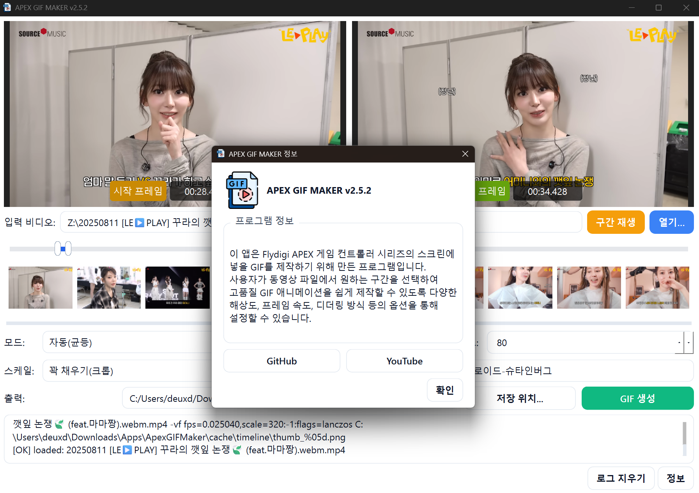

<h1 align=center>
  
  Apex GIF Maker (MP4 → GIF)
</h1>

<p align="center">
  <a href="https://github.com/OWNER/REPO/releases/latest">
    
  </a>
  <a href="https://python.org">
    
  </a>
  <a href="#">
    
  </a>
  <a href="#">
    
  </a>
  <a href="./LICENSE">
    
  </a>
</p>


<p align="center">
  듀얼 핸들 타임라인과 2분할 프리뷰로 <b>2–10초</b> 구간을 잘라 고품질 GIF를 만드는 포터블(무설치) 도구.<br/>
  내부적으로 <code>FFmpeg</code>를 사용하며, 최초 실행 시 자동 준비한다.
</p>

---

## ✨ 주요 기능
- ✂️ **구간 트림**: 듀얼 핸들 + 직접 시간 입력(`mm:ss.mmm` / `hh:mm:ss.mmm`), 길이 **2–10초** 강제
- 🪟 **프리뷰 2분할**: 시작/끝 프레임을 **1280×720**으로 자동 추출해 좌/우 표시(슬라이더/시간 입력 변경 시 자동 갱신)
- 🧭 **타임라인 미니 썸네일**: 2초 간격 스트립으로 구간 탐색
- 🧩 **스케일 모드 3종**: **꽉 채우기(크롭, 기본)** / 레터박스(비율 유지) / 스트레치(왜곡), Lanczos 스케일
- 🤖 **자동·수동 프레임 선택**: 자동(균등 FPS) / 자동(중복 제거 `mpdecimate`) / 수동 체크 선택
- 🎨 **팔레트 2패스**: `palettegen` → `paletteuse` (디더링: `floyd_steinberg`, `bayer`, `none`)
- ⛏️ **FFmpeg 자동 준비(Windows)**: `./ffmpeg-bin`에 essentials ZIP 자동 다운로드/해제(영구), 콘솔창 무표시 실행
- 💾 **기본 저장 경로**: 출력 경로 미지정 시 실행 폴더에 자동 파일명으로 저장
- 🗂️ **캐시 디렉토리**: 실행 폴더 기준 `./cache` (프리뷰/프레임/타임라인)

---

## ⬇️ 다운로드
> **설치가 필요 없다.** 압축 해제 후 실행만 하면 된다.

- 🔽 **최신 버전 받기**  
  👉 [**Releases 페이지**](https://github.com/OWNER/REPO/releases/latest)에서  
  `ApexGIFMaker_v1.0.0_Windows_x64.zip` 다운로드 → 압축 해제 → `ApexGIFMaker.exe` 실행

- 📦 포함 파일(권장 배포 형태)
```text
ApexGIFMaker/
├─ ApexGIFMaker.exe
├─ ffmpeg-bin/ # ffmpeg.exe / ffprobe.exe (없으면 최초 실행 시 자동 다운로드)
└─ cache/ # 실행 중 자동 생성 (삭제해도 무방)
```

- 🧾 무결성 확인(선택)
- `SHA256SUMS.txt`가 제공될 경우, 해시를 비교한다.
- 바이러스 오진이 발생하면 Windows SmartScreen/백신에서 예외로 등록 후 재실행.

---

## 🚀 사용 방법
1) **비디오 열기**: `.mp4/.mov/.mkv/.webm/.avi` 지원  
2) **구간 설정**: 슬라이더 드래그 또는 시작/끝 시간 직접 입력 → 길이 2–10초 유지  
 - 2초 간격 **타임라인 썸네일**로 흐름 확인  
 - 좌/우 **2분할 프리뷰**로 시작/끝 프레임 확인(자동 갱신)  
3) **옵션 선택**: 모드(자동/수동), FPS, 출력 크기, 스케일, 디더링  
4) **출력 경로**: 비워두면 실행 폴더에 자동 파일명으로 저장  
5) **GIF 생성** 클릭

> 기본 스케일: **꽉 채우기(크롭)**. 비율 유지가 필요하면 레터박스 선택.

---

## ⚙️ 옵션 요약

| 옵션 | 값/범위 | 설명 |
|---|---|---|
| 모드 | 자동(균등) / 자동(중복 제거) / 수동 선택 | 자동은 균등 FPS 또는 `mpdecimate`로 중복 프레임 제거 |
| FPS | 1–60 | 프레임률 |
| 크기 | 기본 160×80 | 임의 조정 가능 |
| 스케일 | **꽉 채우기(기본)** / 레터박스 / 스트레치 | <ul><li>꽉 채우기: `scale=...:force_original_aspect_ratio=increase,crop=...`</li><li>레터박스: `scale=...:force_original_aspect_ratio=decrease,pad=...`</li><li>스트레치: `scale=...`</li></ul> |
| 디더링 | `floyd_steinberg` / `bayer` / `none` | 팔레트 적용 시 디더링 방식 |
| 프리뷰 | 1280×720 | 시작/끝 2분할, 입력 변경 시 자동 갱신(디바운스 200ms) |

---

## 🧯 트러블슈팅
- **FFmpeg 다운로드 실패**: 네트워크/방화벽 환경일 수 있음. `ffmpeg-bin` 폴더에 직접 `ffmpeg.exe`/`ffprobe.exe`를 넣고 실행.  
- **콘솔 창 깜빡임**: 내부적으로 숨김 실행. 외부 FFmpeg 경로를 수동 지정했다면 동일 옵션이 적용되는지 확인.  
- **권한 문제**: Program Files 등 보호 폴더에서는 캐시/출력 쓰기가 막힐 수 있다. 사용자 폴더에서 실행 권장.  
- **바이러스 오진**: 자체 제작 도구의 일반적 이슈. 서명되지 않은 실행파일은 오진될 수 있다. 예외 등록 후 사용.

---

## 📝 릴리스 노트
### v1.0.0
- 듀얼 핸들 구간 트림(2–10s), 시간 직접 입력
- 시작/끝 **2분할 프리뷰(1280×720)**, 자동 갱신
- **2초 간격 타임라인 썸네일** 스트립
- 스케일 3종(기본: **꽉 채우기**)
- 자동(균등/중복 제거) & 수동 선택 모드
- 팔레트 2패스 + 디더링 옵션
- FFmpeg 자동 준비/영구 재사용, 콘솔 무표시
- 캐시/저장 경로: 실행 폴더 기준

---

## 🗺️ 로드맵
- 루프 자연스러움 자동 최적화(시작·끝 프레임 유사도 기반 컷 보정)  
- 팔레트 품질 고급 옵션(퍼셉추얼 최적화)  
- 타임라인 썸네일 **클릭 이동/스냅**  
- 미세조정 버튼(±1프레임 / ±0.1s)

---

## 📜 라이선스
- 본 프로젝트는 **MIT License**를 따른다. (상세는 [`LICENSE`](./LICENSE) 참조)

> **서드파티 고지**  
> - **FFmpeg**는 각자의 라이선스(LGPL/GPL 등) 조건을 따른다. 번들/재배포 시 FFmpeg 라이선스 의무 준수.  
> - **PySide6 (Qt for Python)**는 LGPL-3.0 등 Qt 라이선스를 따른다. 정적 링크/재배포 시 의무 조항을 확인.

---

## 🤝 기여
- 버그 리포트/PR 환영  
- 이슈 등록 시 **Windows 버전 / 재현 단계 / 로그** 첨부

